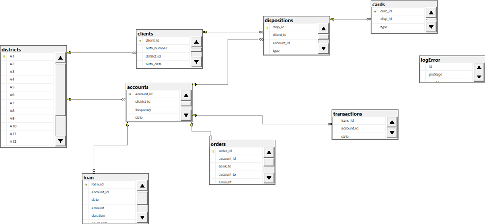
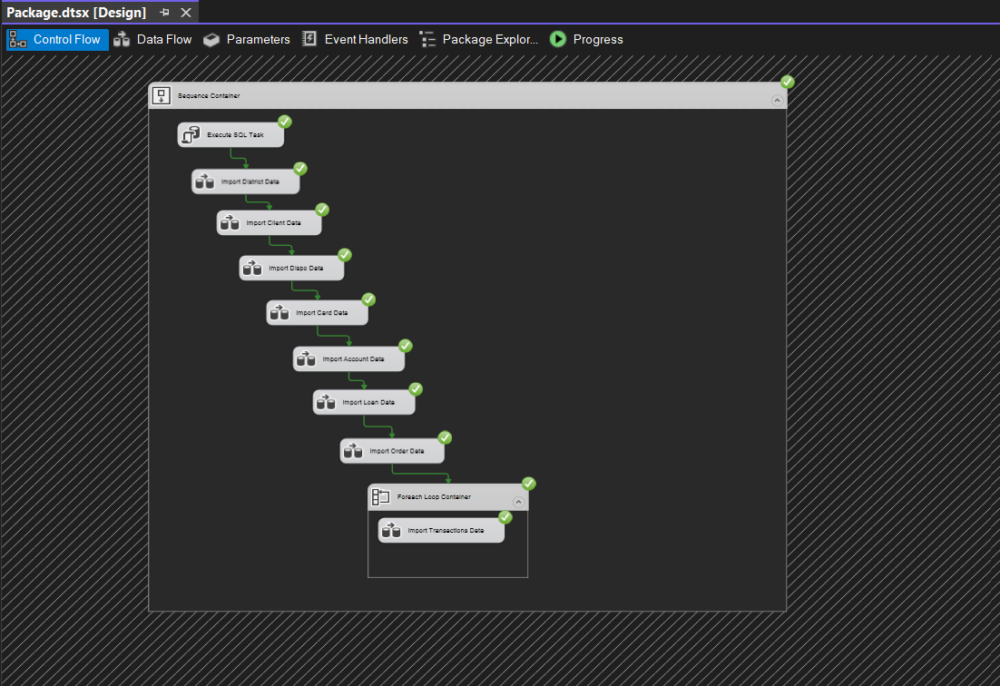

# Project Name: Fintech SSIS Project

## Overview

This SSIS project extracts data from various sources, transforms it, and loads it into a centralized data warehouse.

## Packages

### Package 1: Data Importing

This package extracts sales data from a flat file source and loads it into a SQL Server database. The package includes the following components:

-   Flat File Source: Reads data from a CSV files from FlatFileData directory (note: need to configure in SSIS variables)
-   Data Conversion & Derived: Converts data types from string to appropriate data types for the target database
-   OLE DB Destination: Loads data into a SQL Server table

## Data Mapping

## Data Dictionary

## Sample Run Project Overview
